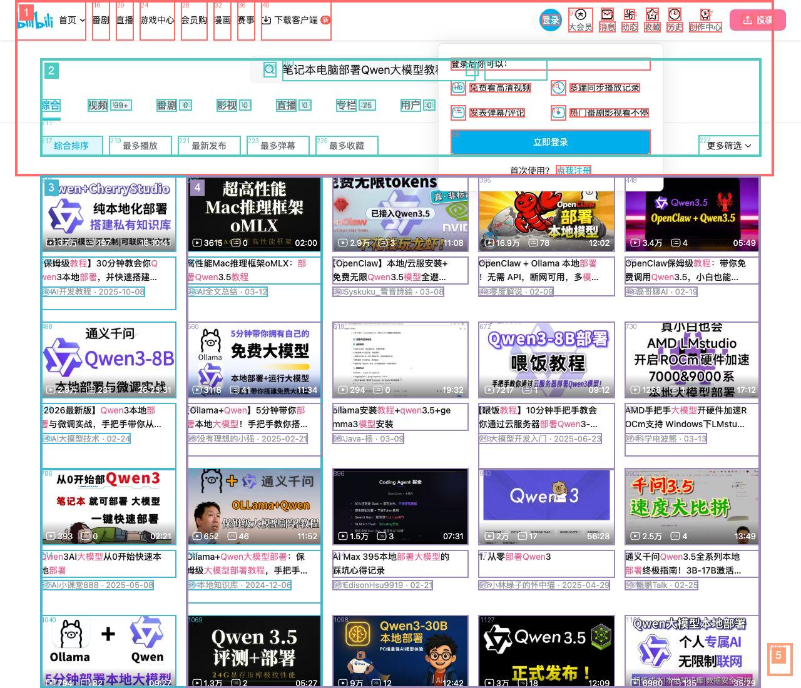
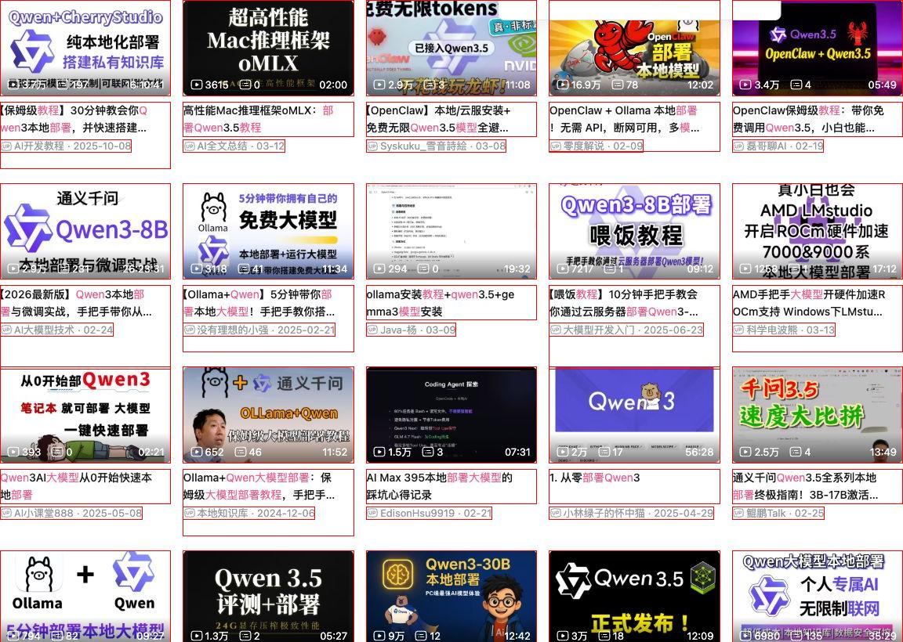
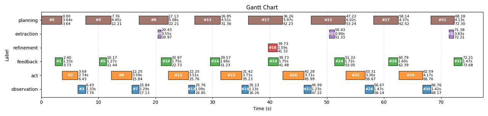

# NaviDOM

[中文README](README_ZH.md)

A LLM-based Browser Agent that automatically executes web tasks from natural-language user instructions.

## Motivation

This project is not about building a “perfect Browser Agent.” Instead, it is meant to validate a research hypothesis:

In the Browser Agent setting, can multi-agent collaboration plus input-compression strategies match or even surpass the efficiency of the current open-source SOTA solution, [Browser Use](https://github.com/browser-use/browser-use)?

Current conclusion: this direction is feasible, and some experimental metrics already show strong potential.
That said, Browser Use still has clear advantages in model training and engineering maturity.

## Key Features

- **Natural-language-driven automation**: provide a task description, and the agent explores pages and completes the task automatically.
- **Multi-agent collaborative scheduling**: a task-scheduling-based collaboration mechanism where models of different sizes cooperate in parallel/serial modes to balance execution efficiency and decision accuracy.
- **Hierarchical compression mechanism**: a layered compression and pruning pipeline for redundant Web GUI input tokens, reducing token usage by roughly one order of magnitude.
- **Observable and traceable execution**: automatic saving of logs, process screenshots, structured outputs (JSON), and execution reports (Markdown + Gantt chart).

## Benchmark Evaluation

Evaluation model setup:
- `vlm_primary_service = qwen3.5-397b-a17b`
- `llm_primary_service = qwen3.5-397b-a17b`
- `vlm_secondary_service = qwen3-vl-2b-instruct`
- `llm_secondary_service = qwen3-4b`

On the [Online-Mind2Web2](https://huggingface.co/datasets/osunlp/Online-Mind2Web) benchmark, the project achieved:

| Difficulty | Success Rate         | Evaluation Coverage   |
| ---------- | -------------------: | --------------------: |
| Easy       | 62/78 = 79.49%       | 78/80 = 97.50%        |
| Medium     | 105/142 = 73.94%     | 142/143 = 99.30%      |
| Hard       | 53/77 = 68.83%       | 77/77 = 100.00%       |
| Total      | 220/297 = 74.07%     | 297/300 = 99.00%      |

> Note: A small number of unfinished samples were mainly caused by environment factors (e.g., invalid web pages or Playwright runtime issues), not because the tasks themselves were unsolvable.

### Token Cost and Latency Analysis

Token consumption per task (including both successful and failed runs):

| Difficulty | Primary Model Tokens (in / out) | Secondary Model Tokens (in / out) |
| ---------- | -------------------------------- | ---------------------------------- |
| Easy       | 32806.75 / 870.71                | 53607.44 / 1599.94                |
| Medium     | 61208.80 / 1624.87               | 99963.57 / 2883.44                |
| Hard       | 82921.47 / 2123.79               | 136125.65 / 4176.77               |
| Overall    | 59296.13 / 1554.09               | 97028.27 / 2877.38                |

Average latency per interaction is **11.17s**. About **7.78s** comes from LLM response time; the remainder is mainly spent on post-action page transitions and network loading.

## System Overview

The system has 6 agents with distinct responsibilities:

1. **Planning**: understand current state and produce the next target.
2. **Act**: execute browser actions (click, type, scroll, navigate, etc.).
3. **Observation**: judge outcomes based on page changes before/after actions.
4. **Extraction**: extract task-relevant key information from web pages.
5. **Feedback**: assess and report task completion progress.
6. **Refinement**: compress historical task context.

Core loop: `Planning -> Act -> Observation` (ReAct loop)

## Core Challenges and Solutions

### 1) GUI DOM tree input is redundant and noisy

In real web pages, the DOM tree is usually very large and contains many elements irrelevant to the current task.
Feeding all of it to the model at once often causes:

- **Higher TTFT (time to first token)**: longer input leads to slower startup.
- **Worse reasoning quality**: too much noise makes the model easier to drift away from the goal.

#### Solution

1. **Rule-based GUI filtering and compression**
   - Filter GUI elements by visibility, interactivity, etc.
   - Compress GUI representation while preserving key information as much as possible.

2. **Task-relevance filtering with a 2B small model**
   - Before each interaction, a 2B model filters out GUI elements irrelevant to the current task.
   - Extra overhead is only about **0.6s**.
   - On average, this saves about **4K input tokens** per interaction for the large model and significantly reduces noise.

Filtering visualization:

<table align="center">
  <tr>
    <td></td>
    <td></td>
  </tr>
</table>

### 2) Multi-step reasoning in a single response is too heavy, slow, and unstable

In one Browser Agent interaction, the model often needs to do several things at once:

- Evaluate whether the previous action was effective
- Reason about the current task state
- Plan the next step
- Generate the action instruction

Packing all objectives into a single response is overly complex and can increase reasoning errors.

#### Solution

1. **Split by complexity into lighter subtasks**
   - Large model (A17B) handles critical logic-reasoning subtasks (e.g., Planning).
   - Small model (2B) handles summarization-style subtasks (e.g., Observation).

2. **Keep only necessary context for each subtask**
   - Some context overlap remains across subtasks.
   - But input/output tokens for the large model decrease substantially while effectiveness is maintained.

3. **Parallel scheduling for subtasks**
   - Parallelizable subtasks run concurrently.
   - In some scenarios, downstream scheduling can be triggered as soon as key fields are available from upstream outputs.
   - This further reduces interaction latency.

The parallelization effect can be seen directly in the Gantt chart:



## Quick Start

### 1) Install dependencies

Use `uv` to install Python dependencies:

```bash
uv sync
```

Activate the virtual environment:

```bash
# linux/macOS
source .venv/bin/activate
# Windows
.venv\Scripts\activate
```

### 2) Install Playwright browsers

```bash
playwright install
```

### 3) Configure model services and runtime parameters

Copy and edit the configuration file:

```bash
cp env.example.json env.json
```

Fill in your model service settings in `env.json`:

- `vlm_primary_service` / `vlm_secondary_service`: vision-language model (VLM) config names.
- `llm_primary_service` / `llm_secondary_service`: language model (LLM) config names.
- `primary` denotes the larger model for key reasoning and decisions.
- `secondary` denotes the smaller model for summarization and auxiliary processing.
- Set each service’s `api_key`, `base_url`, `model`, and `temperature`.

## Running

### Option A: CLI (main.py)

```bash
python main.py \
  --out-dir output/test \
  --task "Find a tutorial video on Bilibili about deploying Qwen large models on a laptop" \
  --start-url "https://www.bilibili.com/"
```

### Option B: Example script (demo.py)

`demo.py` provides a directly runnable example that is convenient for customization and debugging.

## Output Artifacts

For each task run, files are generated under the directory specified by `--out-dir`, including:

- `log.log`: runtime logs
- `result.json`: structured execution result
- `report.md`: human-readable execution report
- `gantt.png`: timeline Gantt chart
- Stage screenshots: before/after actions, observation, planning, etc.

## Project Structure

```text
.
├── agent/
│   ├── agent.py        # Main execution loop: planning/act/observation/extraction/feedback
│   ├── action.py       # Browser action definitions and execution
│   ├── dom.py          # DOM parsing, clustering, and compression logic
│   ├── llm.py          # Multi-model invocation wrapper and token accounting
│   ├── config.py       # Configuration initialization
│   └── record.py       # Execution record schema
├── main.py             # CLI entry
├── demo.py             # Runnable example
├── env.example.json    # Configuration template
└── pyproject.toml      # Dependency configuration
```